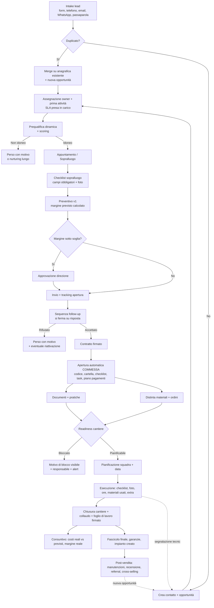
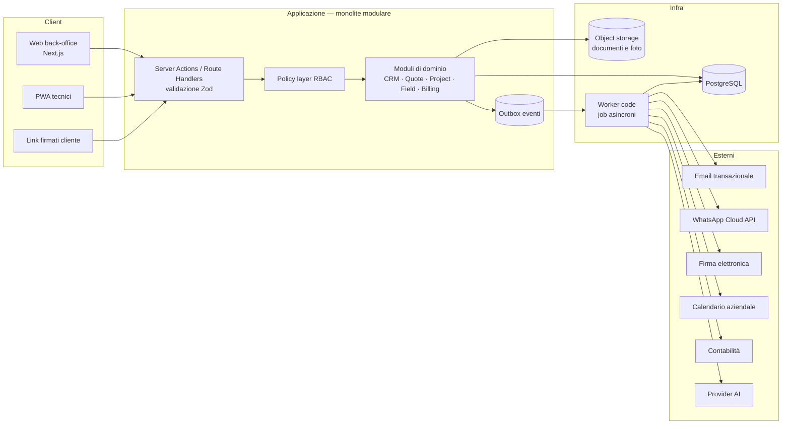
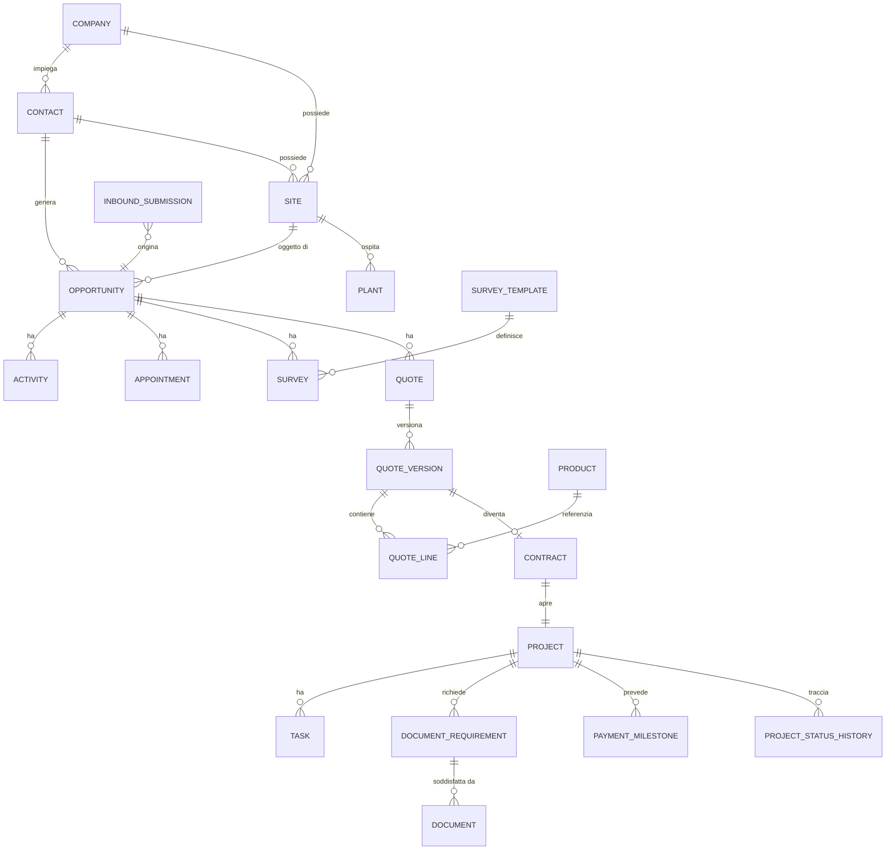

# EcoSolare Operating System — Discovery & Technical Blueprint v1

**Stato:** bozza per approvazione — nessuna implementazione avviata
**Versione:** 1.2 (4 agosto 2026) — recepite le decisioni D-001…D-007
**Autore:** team tecnico di progetto
**Destinatario decisionale:** Direzione EcoSolare

> Questo documento è un contratto di comprensione, non una specifica definitiva.
> Le sezioni 3 (Assunzioni) e 4 (Domande bloccanti) sono le più importanti: contengono
> tutto ciò che oggi non sappiamo e che, se sbagliato, cambia costi, tempi o flussi.

**Modifiche** — le decisioni prese sono tracciate in [`01-registro-decisioni.md`](01-registro-decisioni.md):

- **v1.2** — **D-007: quattro ruoli funzionali** (`amministratore`, `contabilita`, `commerciale`, `cantiere`) + 2 capacità. Riscrive la §11 e supera D-005.
- **v1.1** — D-001 single-tenant confermato · D-002 budget non definito, si procede a impegni brevi · D-003 Google Workspace (SSO, Calendar a senso unico, documenti fuori da Drive) · D-004 software contabile rinviato · D-005 *(superata)* · D-006 privacy senza consulente, azioni minime prima del go-live.

---

## 1. Executive summary

### 1.1 Cosa viene chiesto

Un sistema operativo aziendale centralizzato che copra il ciclo completo
*Lead → Qualifica → Sopralluogo → Preventivo → Contratto → Commessa → Pratiche → Materiali → Cantiere → Controllo economico → Assistenza → Fidelizzazione*
per tre linee di business (fotovoltaico, elettrico, idraulico) con anagrafica cliente unica.

### 1.2 Qual è il problema reale da risolvere

Il brief descrive funzionalità, ma il problema economico sottostante è più stretto e va detto con chiarezza, perché determina le priorità:

1. **I lead si raffreddano** perché la presa in carico dipende da chi vede il messaggio.
2. **I preventivi non vengono inseguiti** perché il follow-up vive nella memoria del commerciale.
3. **I cantieri partono incompleti** (documenti o materiali mancanti) e generano rientri, ore perse e slittamenti.
4. **Il margine reale non è noto** finché la commessa non è chiusa da mesi, quindi non è correggibile.
5. **Il titolare è il collo di bottiglia** perché è l'unico che sa lo stato di tutto.

Ogni funzionalità di questo blueprint è agganciata a uno di questi cinque punti. Ciò che non è agganciato è stato spostato fuori dall'MVP.

### 1.3 Valutazione di fattibilità e scope — punto critico

Il brief, preso alla lettera, descrive **un ERP verticale di settore**: CRM + configuratore/preventivatore + gestione documentale + gestione commesse + mini-procurement + field service management + job costing + ticketing + layer AI.

Stima onesta: **140–200 giornate/uomo senior** per lo scope completo (dettaglio in §21), pari a 7–10 mesi con uno sviluppatore, 4–5 mesi con due.

**Raccomandazione:** non costruire tutto. Costruire in 10–12 settimane un MVP che copre lead → preventivo → apertura commessa → checklist documenti → dashboard, portarlo **in uso reale**, e solo dopo estendere. Un sistema al 40% adottato vale infinitamente più di un sistema al 100% costruito e al 10% usato. Il rischio numero uno di questo progetto non è tecnico, è di adozione.

### 1.4 Decisioni architetturali di fondo (dettaglio in §8)

| # | Decisione | Sintesi |
|---|---|---|
| ADR-01 | Monolite modulare, non microservizi | Next.js full-stack + PostgreSQL, moduli separati da confini applicativi, non di rete |
| ADR-02 | Regole critiche nel backend applicativo | Il motore di automazione esterno non contiene logica di business |
| ADR-03 | Lead non è un'entità separata | Il lead è uno stadio dell'opportunità; entità separata solo per l'intake grezzo |
| ADR-04 | Risposte sopralluogo in JSONB versionato | Non EAV; colonne promosse per i campi usati in filtri e KPI |
| ADR-05 | Outbox transazionale per gli eventi di dominio | Consegna at-least-once + handler idempotenti |
| ADR-06 | Permessi valutati server-side in un policy layer unico | Mai solo nascosti nell'interfaccia |
| ADR-07 | AI dietro un service layer con minimizzazione dei dati | Provider intercambiabile, nessun documento personale integrale inviato di default |
| ADR-08 | Preventivi versionati e immutabili dopo l'invio | Nessuna modifica retroattiva di dati economici |

---

## 2. Obiettivi del sistema

### 2.1 Obiettivi primari (misurabili)

| Obiettivo | Metrica | Baseline | Target 6 mesi |
|---|---|---|---|
| Nessun lead perso o dimenticato | % lead con owner e prossima azione | da misurare in Fase 0 | 100% |
| Risposta rapida | Speed-to-lead mediano in orario di servizio | da misurare | < 15 min (target teso: 5 min) |
| Follow-up sistematico | % preventivi inviati con ≥3 contatti tracciati entro 21 gg | da misurare | > 90% |
| Cantieri che partono completi | % cantieri pianificati senza blocchi documenti/materiali | da misurare | > 95% |
| Margine sotto controllo | % commesse con margine reale calcolato entro 15 gg dalla chiusura | 0% (ipotesi) | > 90% |
| Riduzione dipendenza dal titolare | % attività aperte con responsabile diverso dal titolare | da misurare | > 80% |

> Le baseline **non sono stimabili oggi**. La Fase 0 serve esattamente a misurarle: senza baseline non è dimostrabile alcun ROI.

### 2.2 Obiettivi espliciti di non-scope (v1)

Non sono obiettivi della v1, e vanno detti ora per evitare aspettative:

- sostituire il software di contabilità o emettere fatture elettroniche verso SdI;
- gestire un magazzino fisico con giacenze, lotti e valorizzazione;
- fare dimensionamento tecnico/simulazione di produzione fotovoltaica (PVGIS, ombreggiamenti 3D);
- gestire buste paga, presenze legali o rilevazione ai fini giuslavoristici;
- essere un DMS certificato a norma per la conservazione sostitutiva.

Per ciascuno di questi il sistema prevede **il punto di aggancio** (campo, stato, export, webhook), non l'implementazione.

---

## 3. Assunzioni

Ogni assunzione è marcata con l'impatto che ha se risulta errata.
🔴 = cambia architettura o costi · 🟡 = cambia funzionalità o tempi · 🟢 = cambia solo configurazione

| # | Assunzione | Impatto se errata |
|---|---|---|
| A1 | ✅ **CONFERMATA (D-001)** — Il sistema serve solo EcoSolare (single-tenant) | 🔴 Riapribile solo prima della Fase 3; dopo costa 25–40 gg |
| A2 | Utenti interni fra 8 e 30, di cui 3–10 tecnici sul campo | 🟡 Sopra i 50 cambiano le scelte su performance e onboarding |
| A3 | Volumi indicativi: 30–150 lead/mese, 20–80 preventivi/mese, 50–300 commesse/anno | 🟡 Un ordine di grandezza in più richiede scelte diverse su indici e reportistica |
| A4 | Hosting e dati **in Unione Europea**, obbligatorio | 🔴 Vincola provider di database, storage, email e AI |
| A5 | La lingua dell'interfaccia è **solo italiano**; nessuna i18n richiesta in v1 | 🟢 |
| A6 | Il sistema **non emette fatture**: registra il piano pagamenti e si sincronizza (anche solo in export) con il gestionale contabile esistente | 🔴 Se deve fatturare verso SdI, è un progetto aggiuntivo di 20–30 gg + provider accreditato |
| A7 | Le pratiche di connessione (distributore, GSE, Terna) restano **fuori dal sistema come esecuzione**: il sistema traccia stato, scadenze e documenti, non compila i portali | 🟡 L'automazione dei portali non è realisticamente affidabile né sempre consentita |
| A8 | I tecnici hanno uno smartphone personale o aziendale con browser moderno; si usa una **PWA**, non app native su store | 🟡 App native = +30/40 gg e gestione store |
| A9 | Esiste già una casella email aziendale e un dominio su cui configurare SPF/DKIM/DMARC per l'invio transazionale | 🟢 |
| A10 | WhatsApp verso i clienti passerà da **WhatsApp Business Platform (Cloud API)**, con template approvati da Meta, non dal telefono personale | 🟡 Se si vuole continuare col telefono personale, l'automazione WhatsApp non è realizzabile in modo conforme |
| A11 | La firma dei contratti sarà **elettronica avanzata via provider terzo**, con fallback a firma cartacea/scan sempre disponibile | 🟡 |
| A12 | Il listino materiali è mantenuto **manualmente** (import CSV periodico), senza integrazione realtime con i fornitori | 🟡 Le API fornitori, dove esistono, sono eterogenee: valutabili solo caso per caso |
| A13 | Non è richiesta la rilevazione presenze a fini giuslavoristici: le ore servono al **job costing**. Nessuna geolocalizzazione continua dei tecnici | 🔴 Il tracciamento della posizione dei lavoratori ricade nell'art. 4 dello Statuto dei Lavoratori e richiede accordo sindacale o autorizzazione dell'Ispettorato |
| A14 | Il margine si calcola su: ricavo di commessa − materiali reali − (ore × costo orario configurato per ruolo) − costi esterni. Nessun ribaltamento di costi generali/overhead in v1 | 🟡 L'allocazione degli indiretti è una scelta contabile che va concordata con il commercialista |
| A15 | La migrazione dei dati storici riguarda **anagrafiche clienti e impianti installati**, non lo storico completo di preventivi e comunicazioni | 🟡 |
| A16 | Esiste **una persona interna** disponibile come referente di progetto, con almeno 2–4 ore/settimana | 🔴 Senza referente interno il progetto fallisce l'adozione, indipendentemente dalla qualità del software |
| A17 | Il modello AI utilizzato è della famiglia Claude, dietro un adapter sostituibile; nessun addestramento su dati EcoSolare | 🟢 |
| A18 | Aliquote fiscali, detrazioni e soglie di marginalità sono **dati configurabili con validità temporale**, mai costanti nel codice | 🟢 (ma obbligatorio: le norme cambiano ogni anno) |
| A19 | La contrattualistica e i template documentali esistenti sono forniti da EcoSolare; non vengono redatti dal team tecnico | 🟡 |
| A20 | Ambienti: `staging` e `produzione`. Nessun ambiente dedicato per singolo sviluppatore oltre al locale | 🟢 |

---

## 4. Domande bloccanti

Solo domande la cui risposta **cambia il progetto**. Tutto ciò che può essere una configurazione non è qui.
Per ognuna è indicata la risposta di default che verrà assunta in assenza di risposta.

### 4.1 Prodotto e strategia

| # | Domanda | Perché blocca | Default se non risposta |
|---|---|---|---|
| B1 | ✅ **RISOLTA (D-001)** — solo EcoSolare, single-tenant | — | — |
| B2 | ✅ **RISOLTA (D-002)** — budget e scadenza non definiti | Si procede a impegni brevi: l'unico impegno da assumere ora è lo Sprint 0 (2 settimane), poi punto di decisione a fine di ogni fase | — |
| B3 | ⏳ **APERTA** — È stata valutata l'alternativa "software esistente + personalizzazioni"? | Per parte dello scope esistono soluzioni di settore. Il custom si giustifica dove il processo è distintivo. Va posta una volta, ora, non fra sei mesi | Si procede custom |

### 4.2 Processi

| # | Domanda | Perché blocca |
|---|---|---|
| B4 | Quante persone, con quali ruoli reali, e chi oggi fa concretamente: prima risposta al lead, sopralluogo, preventivo, pratiche, ordini materiali, pianificazione? | La matrice ruoli/permessi e le assegnazioni automatiche dipendono interamente da questo |
| B5 | Il sopralluogo commerciale e quello tecnico sono la stessa visita o due momenti distinti? | Cambia il modello dati (una o due entità) e il flusso della pipeline |
| B6 | Chi approva un preventivo sotto soglia di margine, e la soglia è unica o per linea di business? | È l'unico workflow di approvazione dell'MVP |
| B7 | Qual è oggi il criterio con cui si decide che un cantiere è pianificabile? | È la funzione a più alto valore del sistema: va codificata correttamente, non inventata |

### 4.3 Dati e documenti

| # | Domanda | Perché blocca |
|---|---|---|
| B8 | Dove risiedono oggi i dati clienti (gestionale, Excel, Drive, rubrica telefono) e in che formato sono esportabili? | Determina il piano di migrazione, che è tipicamente sottostimato |
| B9 | Qual è la lista reale dei documenti obbligatori per una commessa fotovoltaica standard, e chi li verifica? | La checklist documentale è il cuore del modulo; deve venire dall'ufficio tecnico, non da noi |
| B10 | Quali pratiche vengono gestite internamente e quali da consulenti esterni? | Determina se servono stati/scadenze interni o solo un tracking di delega |
| B11 | Esiste un listino materiali strutturato con prezzi di acquisto, o i prezzi si chiedono di volta in volta al fornitore? | Se non esiste, il calcolo del margine previsto in fase di preventivo non è affidabile al lancio |

### 4.4 Strumenti e integrazioni

| # | Domanda | Perché blocca |
|---|---|---|
| B12 | ✅ **RISOLTA (D-003)** — Google Workspace. Login SSO Google con dominio aziendale + fallback password; Calendar a senso unico + lettura disponibilità; documenti **non** su Drive |
| B13 | ⏳ **RINVIATA (D-004)** — software contabile da definire. Non blocca fino alla Fase 5. **Unica dipendenza anticipata:** se le numerazioni di preventivi/contratti/commesse devono allinearsi al gestionale contabile, va saputo prima della Fase 2 |
| B14 | Esiste già un numero WhatsApp Business e chi lo gestisce? | Vedi A10; la migrazione a Cloud API ha impatti operativi sul quotidiano |
| B15 | Esiste un fornitore di firma elettronica già in uso o vincoli su di esso? | Adapter da scrivere una volta sola, ma va scelto |
| B16 | Il sito e le landing page da cui arrivano i lead sono sotto il vostro controllo tecnico? | Determina se l'intake è webhook diretto o parsing email |

### 4.5 Sicurezza, GDPR, amministrazione

| # | Domanda | Perché blocca |
|---|---|---|
| B17 | ✅ **RISOLTA (D-005, D-006)** — nessun consulente privacy; accessi su due livelli: amministratore e utente. Restano da fare, senza consulente: nomina titolare, accettazione DPA dei fornitori, informativa sul form, registro trattamenti |
| B18 | ⏳ **APERTA** — È accettabile che estratti di documenti siano elaborati da un provider AI, e con quali categorie escluse? | Determina se il modulo di estrazione documentale è realizzabile. Non blocca prima della Fase 6 |
| B19 | ⏳ **PARZIALE (D-005)** — il ruolo amministratore è definito. Resta da sapere **chi** lo ricoprirà e con quanta autonomia | Determina quanto va reso configurabile da interfaccia invece che dal codice |
| B20 | Le ore registrate dai tecnici verranno usate solo per il costing o anche per finalità di controllo del personale? | Vedi A13: cambia il perimetro di conformità |

---

## 5. Mappa degli attori

| Attore | Obiettivo suo | Cosa deve fare nel sistema | Dolore attuale (ipotesi da validare) |
|---|---|---|---|
| **Titolare / Direzione** | Sapere e decidere senza chiedere | Dashboard, approvazioni sopra soglia, alert su blocchi | È il collo di bottiglia informativo di tutta l'azienda |
| **Commerciale** | Chiudere più contratti | Lavorare la pipeline, sopralluoghi, preventivi, follow-up | Ricorda a memoria, preventivi lenti, perde i tiepidi |
| **Ufficio tecnico** | Progettare senza rilavorare | Dati sopralluogo, verifica tecnica, distinta, pratiche | Riceve sopralluoghi incompleti e ricontatta il cliente |
| **Back-office** | Chiudere le pratiche | Documenti, scadenze, solleciti, stato amministrativo | Insegue documenti via WhatsApp senza traccia |
| **Responsabile cantieri** | Far partire cantieri che non si fermano | Pianificazione, squadre, materiali, avanzamento | Scopre i blocchi la mattina stessa |
| **Tecnico / Installatore** | Sapere cosa fare, con meno carta possibile | Lavori del giorno, checklist, foto, ore, foglio di lavoro | Telefonate per informazioni, fogli di lavoro su carta |
| **Amministrazione** | Incassare puntualmente | Piano pagamenti, stato incassi, costi reali | Nessuna visibilità sul consuntivo di commessa |
| **Cliente finale** | Capire a che punto è il suo impianto | Caricare documenti, confermare appuntamenti, firmare | Chiama per chiedere aggiornamenti |

> **Nota:** il cliente finale non è un utente dell'MVP. Riceve link firmati per singola azione (caricare un documento, confermare un appuntamento, visionare un preventivo). Un portale cliente completo è post-MVP.

---

## 6. Processo end-to-end

### 6.1 Flusso principale



### 6.2 I quattro momenti di verità

Il sistema si giudica su quattro passaggi. Se questi quattro funzionano, il resto è contorno.

1. **Intake → owner + prossima azione** (nessun lead orfano)
2. **Sopralluogo → preventivo senza ricontattare il cliente** (dati completi al primo colpo)
3. **Firma → commessa aperta con tutto già impostato** (zero setup manuale)
4. **Readiness cantiere** (il sistema dice *perché* un cantiere non parte, e chi deve agire)

### 6.3 Readiness di commessa — funzione centrale

Non è uno stato scritto a mano: è **calcolata** e sempre spiegabile.

```
readiness(commessa) = {
  stato: NON_PIANIFICABILE | QUASI_PIANIFICABILE | PIANIFICABILE,
  bloccanti: [ { tipo, descrizione, responsabile, da_quanti_giorni } ],
  avvisi:    [ ... ]
}
```

Regole bloccanti configurabili, per esempio:
- documento obbligatorio in stato ≠ approvato;
- materiale critico non ordinato o non consegnato;
- pratica obbligatoria non inviata;
- conferma cliente mancante;
- verifica tecnica non completata.

Questa singola funzione produce: la lista "cantieri pianificabili", gli alert direzionali, il KPI "giorni di blocco" e le domande all'assistente AI direzionale. Va costruita per prima, dopo l'anagrafica.

---

## 7. Moduli funzionali

| Modulo | Scopo | MVP | Dipende da |
|---|---|---|---|
| M0 Core & piattaforma | Auth, ruoli, policy, audit, config, eventi | ✅ | — |
| M1 Anagrafiche | Contatti, aziende, siti, impianti | ✅ | M0 |
| M2 Intake & dedup | Ricezione lead multi-canale, normalizzazione, merge | ✅ | M1 |
| M3 Pipeline commerciale | Opportunità, stati, prossima azione, motivi di perdita | ✅ | M1 |
| M4 Attività & agenda | Task, appuntamenti, calendario, reminder | ✅ | M3 |
| M5 Prequalifica | Questionario condizionale + scoring | ✅ | M3 |
| M6 Sopralluoghi | Template checklist, foto, validazioni, report | ✅ | M4 |
| M7 Preventivazione | Listini, righe, versioni, margine, PDF, invio | ✅ | M6 |
| M8 Follow-up | Sequenze con condizioni di stop | ✅ | M7 |
| M9 Documenti | Requisiti, upload, stati, versioni, scadenze | ✅ | M1 |
| M10 Commesse | Apertura da contratto, stati, task, readiness | ✅ (base) | M7, M9 |
| M11 Dashboard | KPI direzione + viste operative | ✅ (essenziale) | tutti |
| M12 Comunicazioni | Email, WhatsApp, SMS, log, template | ✅ (solo email) | M0 |
| M13 Materiali & fornitori | Catalogo, distinta, ordini, consegne | ❌ Fase 3 | M10 |
| M14 Pianificazione cantieri | Calendario squadre, work order, conflitti | ❌ Fase 4 | M10, M13 |
| M15 App tecnica (PWA) | Lavori, checklist, foto, ore, foglio di lavoro | ❌ Fase 4 | M14 |
| M16 Controllo economico | Consuntivo, scostamenti, margine reale | ❌ Fase 5 | M15 |
| M17 Fatturazione & incassi | Piano pagamenti, stato incassi, export contabile | ❌ Fase 5 | M10 |
| M18 Ticket & assistenza | Ticket, SLA, interventi | ❌ Fase 6 | M15 |
| M19 Post-vendita | Fascicolo, manutenzioni, recensioni, referral | ❌ Fase 6 | M18 |
| M20 AI | Assistenti commerciale, tecnico, back-office, direzionale | ❌ Fase 6 | dati reali in produzione |
| M21 Integrazioni | Calendario, firma, contabilità, WhatsApp | parziale | M0 |

**Regola di sequenza:** il modulo AI (M20) arriva per ultimo non per prudenza tecnologica, ma perché un assistente su dati incompleti produce risposte sbagliate e distrugge la fiducia degli utenti nel sistema.

---

## 8. Architettura tecnica

### 8.1 Vista d'insieme



### 8.2 Stack proposto

| Livello | Scelta | Motivo | Alternativa considerata |
|---|---|---|---|
| Frontend + backend | **Next.js (App Router) + TypeScript strict** | Un solo runtime, un solo deploy, server-side by default | Frontend React separato + API NestJS — più pulito, ma raddoppia il lavoro per un team piccolo |
| Database | **PostgreSQL** (Neon o Supabase, regione UE) | Relazionale, JSONB, transazioni, maturo | MySQL — nessun vantaggio qui |
| Accesso dati | **Drizzle ORM + migrazioni SQL versionate** | Tipizzato, SQL trasparente, migrazioni leggibili | Prisma — ottima DX, meno controllo sulle query complesse di reporting |
| Auth | **Auth.js — SSO Google Workspace (dominio aziendale) + fallback email/password**; MFA delegata a Google (D-003a) | Un solo posto dove si gestiscono le persone; la 2FA la impone già Workspace | Clerk/WorkOS — più veloci, costo ricorrente e dati utente fuori |
| Calendario | **Google Calendar API — scrittura degli appuntamenti + lettura fasce occupate** (D-003b) | Copre il 90% del valore senza i bug della sync bidirezionale | Sync bidirezionale — riconsiderabile in Fase 4 |
| Autorizzazione | **Policy layer applicativo centralizzato** (`can(user, action, resource)`) | Un solo punto di verità, testabile | RLS PostgreSQL — potente ma difficile da debuggare e da far evolvere |
| Storage documenti | **Object storage S3-compatible UE** (Cloudflare R2 / Scaleway) | Fuori dal DB, URL firmati a scadenza breve | Blob nel DB — da escludere |
| Job & code | **pg-boss su PostgreSQL** | Nessuna infrastruttura aggiuntiva, transazionale con l'outbox | Inngest/Temporal — ottimi, ma dipendenza esterna e costo per volumi bassi |
| Validazione | **Zod su ogni confine** (form, API, webhook, payload AI) | Nessun input non validato | — |
| Email | Provider transazionale con dominio autenticato (SPF/DKIM/DMARC) | Deliverability | — |
| PDF | Rendering server-side da template HTML | Controllo tipografico, versionabile | Librerie PDF imperative — più fragili |
| AI | **Adapter `AiProvider`**, default famiglia Claude | Sostituibile, testabile con mock | Chiamate dirette sparse nel codice — da vietare |
| Deploy | Vercel o container su provider UE + staging | Semplicità operativa | — |
| Osservabilità | Error tracking + log strutturati + metriche automazioni | Le automazioni falliscono in silenzio se non osservate | — |

### 8.3 Decisioni architetturali con motivazione (ADR)

**ADR-01 — Monolite modulare.** Con 8–30 utenti, i microservizi aggiungerebbero solo costi operativi. I confini sono di *modulo* (cartelle, interfacce pubbliche, nessun import trasversale non dichiarato), non di rete. Se un modulo dovrà mai essere estratto, il confine c'è già.

**ADR-02 — Le regole critiche vivono nel backend applicativo.** Un motore di automazione esterno (n8n, Make) può gestire comunicazioni, sincronizzazioni e webhook. Non può contenere: transizioni di stato, calcolo del margine, readiness, permessi. Motivo: quelle regole devono essere testabili, versionate e non modificabili da chi non sa cosa sta rompendo.

**ADR-03 — Il "lead" non è un'entità separata.** Il lead è un'opportunità nei primi stati. Un'entità separata costringe a una conversione con duplicazione di dati e a query doppie ovunque. Resta separata solo `inbound_submission`: il payload grezzo immutabile ricevuto dal canale, conservato per audit e deduplica. *Alternativa:* tabella `leads` distinta — più familiare a chi arriva da altri CRM, ma paga duplicazione per sempre.

**ADR-04 — Risposte dei questionari in JSONB.** Prequalifica e sopralluoghi hanno decine di campi che cambieranno spesso. EAV normalizzato renderebbe ogni lettura una query complessa. Si usa: `template` versionato (definizione dei campi, condizioni, obbligatorietà) + `answers jsonb` validato contro il template + **colonne promosse** per i pochi campi usati in filtri e KPI (es. potenza stimata, tipo tetto, comune). *Costo:* le migrazioni di template richiedono una strategia di compatibilità, prevista fin dall'inizio.

**ADR-05 — Outbox transazionale.** L'evento di dominio viene scritto nella stessa transazione della modifica dati; un worker lo consegna. Ogni handler è idempotente su `(event_id, handler_name)`. Questo elimina la classe di bug "email inviata due volte" / "task creato tre volte", che è la causa principale di sfiducia negli automatismi.

**ADR-06 — Permessi server-side.** L'interfaccia nasconde, il backend nega. Ogni query di lista passa da uno scope obbligatorio (es. il commerciale vede solo le proprie opportunità). Test di autorizzazione obbligatori per ogni endpoint.

**ADR-07 — AI con minimizzazione.** Nessuna chiamata AI riceve documenti di identità o dati non necessari. Ogni interazione è registrata in `ai_interactions` (prompt sintetico, modello, costo, esito, utente). Ogni output AI è una **proposta** che richiede conferma umana prima di diventare dato.

**ADR-08 — Immutabilità economica.** Una versione di preventivo, una volta inviata, non si modifica: si crea la versione successiva. Costi e ricavi consuntivati non si sovrascrivono senza riga di audit. Nessuna cancellazione fisica di dati economici (soft delete + audit).

### 8.4 Convenzioni tecniche

- Database e codice in **inglese** (`snake_case` per SQL, `camelCase` per TS); interfaccia utente in **italiano**. Evita il pasticcio dei nomi misti.
- Importi: `numeric(14,2)` per totali, `numeric(14,4)` per prezzi unitari. **Tutti i calcoli economici avvengono server-side**; il client non calcola mai un totale che verrà salvato.
- Date/orari in `timestamptz`, fuso applicativo `Europe/Rome`.
- Ogni tabella: `id` (uuid v7), `created_at`, `updated_at`, `created_by`, `updated_by`, `deleted_at` dove ha senso.
- Nessuna modifica strutturale al DB senza migrazione versionata in repository.

---

## 9. Modello dati preliminare

### 9.1 Nucleo (MVP) — diagramma



### 9.2 Tabelle — perimetro e fase

Il brief elenca ~60 tabelle. Alcune sono premature, altre vanno fuse. Valutazione tabella per tabella:

**MVP (Fasi 1–2) — 26 tabelle**

`users`, `roles`, `user_roles`, `contacts`, `companies`, `company_contacts`, `sites`, `inbound_submissions`, `lead_sources`, `opportunities`, `opportunity_status_history`, `activities`, `appointments`, `survey_templates`, `surveys`, `products`, `price_lists`, `price_list_items`, `quotes`, `quote_versions`, `quote_lines`, `document_requirements`, `documents`, `document_versions`, `communications`, `audit_logs`, `domain_events` (outbox), `automation_runs`, `app_settings`.

**Fase 3–4 — +14**
`contracts`, `projects`, `project_status_history`, `tasks`, `task_templates`, `checklist_templates`, `checklist_items`, `suppliers`, `project_materials`, `purchase_orders`, `purchase_order_lines`, `deliveries`, `work_orders`, `teams`.

**Fase 5–6 — +12**
`time_entries`, `site_reports`, `photos`, `issues`, `variations`, `payment_milestones`, `invoices`, `payments`, `support_tickets`, `maintenance_plans`, `reviews`, `ai_interactions`.

**Tabelle del brief che NON verranno create, con motivazione:**

| Tabella proposta | Decisione | Motivo |
|---|---|---|
| `leads` | ❌ fusa in `opportunities` | ADR-03 |
| `properties` + `sites` | ❌ una sola: `sites` | Distinzione non operativa per EcoSolare; un sito ha campi di immobile |
| `permissions` (tabella) | ❌ costanti in codice | I permessi sono un enum del dominio; solo le assegnazioni ruolo→permesso stanno in DB, e solo se serve configurabilità (B19) |
| `services` | ❌ fusa in `products` con `type` | Stessa struttura, stesso uso nelle righe di preventivo |
| `survey_answers` | ❌ JSONB in `surveys` | ADR-04 |
| `technicians`, `skills`, `technician_skills` | 🟡 rinviate | `users` con `role` copre l'MVP; le competenze servono solo quando la pianificazione diventa vincolata |
| `materials` | ❌ fusa in `products` | Un materiale è un prodotto acquistabile |
| `campaigns` | 🟡 rinviata | Campi `utm_*` su `inbound_submissions` bastano finché non c'è gestione campagne strutturata |
| `referrals` | 🟡 rinviata | Un referral è un'opportunità con `source = referral` e riferimento al segnalatore |
| `notifications` | ✅ ma tardi | Fino a Fase 4 email + badge in-app sono sufficienti |
| `webhooks`, `integrations` | 🟡 rinviate | Config in `app_settings` finché le integrazioni sono < 5 |

### 9.3 Dettaglio delle tabelle a maggior rischio di errore

**`opportunities`** — l'entità centrale del commerciale.
```
id, contact_id, company_id?, site_id?, business_line (fv|elettrico|idraulico),
stage, stage_since, owner_id, source_id, estimated_value, probability,
next_action_id?, next_action_due_at, lost_reason?, competitor?,
prequalification jsonb, score, score_computed_at,
first_response_at, created_at, ...
```
Vincolo di dominio: **un'opportunità in stato aperto senza `next_action_due_at` è un errore di sistema**, non un caso ammesso. Reso visibile in dashboard e verificato da un job giornaliero.

**`quote_versions`** — dove si gioca il margine.
```
id, quote_id, version_no, status (draft|pending_approval|sent|accepted|rejected|expired),
valid_until, sent_at, viewed_at, decided_at,
revenue_net, cost_materials_est, cost_labour_est, cost_external_est,
margin_amount, margin_pct, discount_amount, vat_breakdown jsonb,
approved_by?, approved_at?, approval_note?, pdf_document_id?, snapshot jsonb
```
`snapshot` congela listino, aliquote e regole al momento dell'invio: un preventivo inviato deve essere ricostruibile identico anche dopo che il listino è cambiato. Dopo `sent`, la riga è immutabile a livello applicativo.

**`documents` / `document_requirements`** — la parte che il brief giustamente insiste a non basare sui nomi file.
```
document_requirements: id, scope (opportunity|project|contact), scope_id,
  code, label, mandatory, due_at, status, responsible_id, notes

documents: id, requirement_id?, contact_id?, project_id?, category,
  storage_key, filename, mime, size, checksum, uploaded_by, source (interno|cliente|email),
  status (caricato|da_verificare|approvato|respinto|scaduto), verified_by?, verified_at?,
  rejection_reason?, expires_at?, version_no
```

**`domain_events`** (outbox)
```
id, event_type, aggregate_type, aggregate_id, payload jsonb, occurred_at,
actor_id?, correlation_id, published_at?, attempts, last_error?
```
+ `event_handler_runs (event_id, handler_name, status, ran_at)` con vincolo univoco: **è questo il meccanismo di idempotenza**.

### 9.4 Nota su cosa NON va nel database

Numeri di carta, credenziali di portali esterni, token di terze parti in chiaro: mai. I segreti stanno nel secret manager dell'ambiente; i token di integrazione, se necessari, cifrati a livello applicativo con chiave fuori dal DB.

---

## 10. Eventi di dominio

Ogni evento ha: chiave di idempotenza, consumatori dichiarati, e un test che verifica che la doppia consegna non produca effetti doppi.

| Evento | Emesso quando | Consumatori | Effetto principale |
|---|---|---|---|
| `LeadReceived` | Arriva un intake grezzo | Dedup, Assignment | Crea/collega opportunità, calcola SLA |
| `OpportunityCreated` | Nuova opportunità | Activity, Notification | Crea prima attività, notifica owner |
| `OpportunityAssigned` | Cambio owner | Notification | Notifica, resetta SLA presa in carico |
| `OpportunityStageChanged` | Transizione di stato | History, Automation, KPI | Storico, sequenze, metriche di funnel |
| `FirstResponseRecorded` | Primo contatto tracciato | KPI | Chiude la misura speed-to-lead |
| `AppointmentScheduled` | Appuntamento fissato | Calendar, Comms | Sync calendario, conferma al cliente |
| `AppointmentOutcomeRecorded` | Esito registrato | Pipeline | Avanza o rischedula |
| `SurveyCompleted` | Sopralluogo chiuso e validato | Quote, Task | Sblocca preventivazione, crea task tecnici |
| `QuoteSubmittedForApproval` | Margine sotto soglia | Approval | Richiesta di approvazione a direzione |
| `QuoteApproved` / `QuoteRejectedInternally` | Decisione interna | Quote | Sblocca o blocca invio |
| `QuoteSent` | Invio al cliente | Follow-up, Comms | Avvia sequenza, registra comunicazione |
| `QuoteViewed` | Cliente apre il preventivo | Follow-up, Notification | Alza priorità, notifica commerciale |
| `QuoteAccepted` | Accettazione | Contract | Genera contratto |
| `ContractSigned` | Firma completata | Project | **Apertura automatica commessa** |
| `ProjectCreated` | Commessa aperta | Documents, Tasks, Payments | Checklist, task, piano pagamenti, cartella |
| `DocumentUploaded` / `DocumentApproved` / `DocumentRejected` | Ciclo documentale | Readiness, Comms | Ricalcolo readiness, sollecito |
| `MaterialOrdered` / `MaterialDelivered` | Ciclo acquisti | Readiness | Ricalcolo readiness |
| `ProjectReadinessChanged` | Readiness cambia | Notification, Dashboard | Alert su blocco/sblocco |
| `WorkOrderScheduled` | Cantiere pianificato | Comms, Calendar | Conferma cliente, notifica squadra |
| `WorkStarted` / `WorkCompleted` | Esecuzione | Costing, Project | Ore, materiali, avanzamento |
| `VariationRequested` | Extra in cantiere | Approval, Costing | Approvazione + impatto a margine |
| `PaymentReceived` | Incasso registrato | Project, KPI | Stato incassi, DSO |
| `TicketOpened` / `TicketResolved` | Assistenza | SLA, Post-vendita | Blocca eventuale richiesta recensione |
| `ReviewRequested` | Post-chiusura | Comms | Solo se nessun ticket grave aperto |

**Regola di idempotenza obbligatoria:** ogni handler dichiara una chiave naturale (es. `follow_up_seq:{quote_version_id}`) e usa un vincolo univoco in DB. Nessun handler si affida al fatto che l'evento arrivi una volta sola.

---

## 11. Ruoli e permessi

> **Riscritta in v1.2 per D-007** (supera D-005 e la matrice a 8 ruoli della v1).
> Modello adottato: **4 ruoli funzionali + 2 capacità sul singolo utente**.

### 11.1 I quattro ruoli

I ruoli seguono le aree funzionali, non la gerarchia. Corrispondono ai quattro tratti del ciclo
*vendo → apro e amministro → costruisco → incasso*.

| Ruolo | Presidia | Assorbe dai ruoli del brief |
|---|---|---|
| `amministratore` | Tutto, incluse configurazioni, utenti, integrazioni, audit | Amministratore + Titolare/Direzione |
| `contabilita` | Fatture, pagamenti, incassi, scadenze, documenti, pratiche | Amministrazione + Back-office |
| `commerciale` | Lead, opportunità, sopralluoghi, preventivi, follow-up | Commerciale |
| `cantiere` | Verifica tecnica, materiali, pianificazione, esecuzione, fogli di lavoro | Ufficio tecnico + Resp. cantieri + Installatore (con `is_field_only`) |

### 11.2 Matrice permessi

Legenda: **T** = completo · **S** = scrittura sul proprio ambito · **L** = sola lettura · **—** = nessun accesso · **A** = approva

| Area | `amministratore` | `contabilita` | `commerciale` | `cantiere` |
|---|---|---|---|---|
| Anagrafiche: contatti, aziende, siti, impianti | T | S | S | L |
| Timeline cliente (storico unico) | T | L | L | L (solo commesse proprie) |
| Intake lead e deduplica | T | — | S | — |
| Opportunità e pipeline | T | L | S | — |
| Prequalifica e scoring | T | — | S | L |
| Appuntamenti e attività | T | S (proprie) | S | S |
| Sopralluoghi | T | L | S | S |
| Preventivi — prezzi di vendita e condizioni | T | L | S | L |
| **Preventivi — costi di acquisto e margine in €** | T | T | `can_view_costs` | `can_view_costs` |
| Preventivi — margine % e indicatore soglia | T | T | L | — |
| **Approvazione preventivi sotto soglia** | **A** | — | — | — |
| Contratti | T | S | L | — |
| Documenti e checklist documentale | T | T | S (propri clienti) | L (della commessa) |
| Pratiche e scadenze | T | T | L | S (tecniche) |
| Commesse, task, readiness | T | S (amministrativo) | L | S (operativo) |
| Materiali e ordini fornitore *(F3)* | T | L | — | S |
| Costi materiali e prezzi fornitore *(F3)* | T | T | — | `can_view_costs` |
| Pianificazione cantieri e squadre *(F4)* | T | L | L | S |
| Ore e fogli di lavoro *(F4)* | T | L | — | S |
| Economics di commessa, margine reale *(F5)* | T | T | — | `can_view_costs` |
| Fatture, pagamenti, incassi *(F5)* | T | T | L (solo stato) | — |
| Ticket e assistenza *(F6)* | T | L | S | S |
| Dashboard direzionale completa | T | L (economica) | L (commerciale) | L (operativa) |
| Sviluppo (laboratorio Solar / dimensionamento) *(D-016)* | T | — | S | — |
| **Configurazioni**: listini, soglie, template, stati, automazioni | T | — | — | — |
| **Gestione utenti e capacità** | T | — | — | — |
| **Audit log** | T | — | — | — |
| **Integrazioni e segreti** | T | — | — | — |

### 11.3 Capacità (flag sull'utente, non nuovi ruoli)

Due sole. Sono ciò che evita di moltiplicare i ruoli a ogni eccezione.

**`can_view_costs`** — visibilità di costi di acquisto e margine in euro.
Default: `amministratore` ✅ · `contabilita` ✅ · `commerciale` ❌ · `cantiere` ❌.
Il commerciale vede prezzo di vendita, margine **percentuale** e indicatore sopra/sotto soglia: è quanto serve per negoziare. Non vede i prezzi di acquisto dai fornitori — l'unico dato la cui diffusione ha un effetto economico immediato e irreversibile. Il responsabile cantieri che deve presidiare il budget di commessa lo ottiene con un click dell'amministratore.

**`is_field_only`** — vista di campo soltanto (Fase 4, non nell'MVP).
Si applica sopra il ruolo `cantiere` e distingue l'installatore dal responsabile: solo lavori assegnati, checklist, foto, ore, fogli di lavoro; nessun importo. Non è solo sicurezza: su uno schermo da 6 pollici, mostrare l'intero gestionale a un installatore garantisce che non lo userà.

### 11.4 Regole non negoziabili

1. I permessi sono valutati **server-side** dal policy layer `can(user, action, resource)`. L'interfaccia nasconde, il backend nega (ADR-06).
2. Ogni lista è filtrata da uno **scope applicato nella query**, non nel rendering.
3. **L'anagrafica è leggibile da tutti i ruoli.** È il presupposto della fonte unica di verità: se un tecnico non trova il cliente, ricomincia a telefonare in giro e il sistema ha già fallito.
4. **Un utente ha un solo ruolo.** I ruoli multipli sembrano flessibili e producono permessi imprevedibili. Chi fa due mestieri prende il ruolo più ampio, oppure `amministratore`.
5. La 2FA per gli amministratori è **imposta da Google Workspace** (D-003a): va attivata lì come obbligatoria per gli account admin.
6. Ogni negazione di permesso viene loggata. Un pattern di tentativi ripetuti è un segnale, non rumore.
7. I costi non devono comparire **nemmeno nel payload JSON** delle pagine servite a chi non ha `can_view_costs`. Nasconderli via CSS è un finto controllo.

### 11.5 Rischi accettati, esplicitamente

**Nessun silo interno al ruolo.** Tutti i `commerciale` vedono tutte le opportunità, tutti i `cantiere` vedono tutti i cantieri. Con 1–3 persone per area il siloing crea più attrito di quanto protegga. Da riaprire se entrano **agenti a provvigione**, collaboratori commerciali esterni o personale stagionale.

**Due assorbimenti da validare in Sprint 0**, perché sono le uniche scelte che potrebbero richiedere un quinto ruolo:

| Assorbimento | Regge se | Va separato se |
|---|---|---|
| Back-office → `contabilita` | Documenti, pratiche e amministrazione sono presidiati dalla stessa persona | Sono due persone con esigenze diverse: serve un ruolo `backoffice` (+2–3 gg) |
| Ufficio tecnico → `cantiere` | La catena sopralluogo tecnico → progettazione → distinta → esecuzione è continua | Progettazione e cantiere sono funzioni nettamente separate (+2–3 gg) |

Si verificano con due domande durante le interviste dello Sprint 0.

---

## 12. Automazioni prioritarie

Ordinate per rapporto valore/costo. Ogni automazione ha una **guardia** (quando NON deve agire), perché un'automazione che manda il messaggio sbagliato al cliente sbagliato distrugge più valore di quanto ne crei.

| # | Automazione | Trigger | Azione | Guardia | Valore |
|---|---|---|---|---|---|
| 1 | Presa in carico lead | `LeadReceived` | Assegna owner, crea attività "contattare entro X", notifica | Fuori orario → coda del mattino, non notifica notturna | Speed-to-lead |
| 2 | Risposta immediata al lead | `LeadReceived` | Email/WhatsApp di conferma ricezione | Solo se consenso e canale validi; mai se duplicato di un contatto in corso | Conversione |
| 3 | Rilevazione duplicati | `LeadReceived` | Match su telefono normalizzato E.164, email, nome+indirizzo | Non fonde mai in automatico: propone e chiede conferma | Qualità dati |
| 4 | Nessuna opportunità senza prossima azione | Job giornaliero | Alert all'owner + escalation a direzione dopo N giorni | — | Pipeline che non si svuota da sola |
| 5 | Sequenza follow-up preventivo | `QuoteSent` | Sequenza giorni 0/2/5/10/21 | **Stop su:** risposta cliente, accettazione, perdita, sospensione manuale, ticket aperto, ferie del cliente segnalate | Conversione |
| 6 | Notifica apertura preventivo | `QuoteViewed` | Notifica al commerciale + alza priorità | Non notificare più di 1 volta/giorno per lo stesso preventivo | Tempismo commerciale |
| 7 | Apertura commessa da firma | `ContractSigned` | Codice, cartella, checklist documenti, task, piano pagamenti, responsabili | Idempotente su `contract_id` | Elimina 1–2 ore di setup manuale per commessa |
| 8 | Sollecito documenti mancanti | Job giornaliero | Sollecito al cliente + task al back-office | Max 1 sollecito ogni N giorni, mai se il documento è in verifica | Riduce giorni di blocco |
| 9 | Ricalcolo readiness | Eventi documenti/materiali/pratiche | Aggiorna stato + motivi di blocco + alert su cambio | Solo su cambio effettivo, non a ogni evento | Cuore del sistema |
| 10 | Reminder appuntamento | T-24h / T-2h | Promemoria a cliente e tecnico | Solo appuntamenti confermati | No-show |
| 11 | Alert margine sotto soglia | `QuoteSubmittedForApproval` | Richiesta approvazione a direzione | — | Margine protetto |
| 12 | Richiesta recensione | Chiusura commessa + N giorni | Richiesta recensione al cliente | **Mai** se ticket grave aperto, reclamo, insoluto o variazione contestata | Reputazione |

Ogni esecuzione è registrata in `automation_runs` con esito, tentativi ed errore. Fallimenti persistenti finiscono in una dead-letter visibile all'amministratore: **un'automazione che fallisce in silenzio è peggio di nessuna automazione**.

---

## 13. Funzioni AI

### 13.1 Principio

L'AI in questo sistema ha **tre soli mestieri leciti**: riassumere, precompilare, segnalare. Non decide, non approva, non invia nulla di irreversibile.

Dove una regola deterministica funziona (calcolo margine, readiness, scoring, scadenze), **non si usa l'AI**. Questo esclude la maggior parte dei casi d'uso che sembrano "AI" e in realtà sono SQL.

### 13.2 Casi d'uso, in ordine di rapporto valore/rischio

| Assistente | Funzione | Rischio | Controllo umano |
|---|---|---|---|
| Back-office | Estrazione dati da bolletta (POD, potenza, consumo annuo) e da documenti identità → precompilazione campi | Medio (errori di lettura) | Campi precompilati evidenziati, salvataggio solo dopo conferma |
| Commerciale | Riassunto storico cliente + proposta di prossima azione | Basso | Suggerimento, mai azione automatica |
| Commerciale | Bozza email di follow-up personalizzata | Basso | Sempre in bozza, mai invio diretto |
| Tecnico | Riassunto sopralluogo + segnalazione campi mancanti o incoerenti | Basso | Report interno, revisione tecnica obbligatoria |
| Tecnico | Classificazione automatica delle foto di cantiere per categoria | Basso | Correggibile |
| Direzione | Interrogazione in linguaggio naturale su dati autorizzati | **Alto se mal fatto** | Vedi §13.3 |

### 13.3 Assistente direzionale — come va costruito

Il modo sbagliato: dare al modello accesso al database e lasciargli scrivere SQL. Produce numeri plausibili e sbagliati, cioè il peggior esito possibile per un sistema di controllo di gestione.

Il modo corretto:
1. Un catalogo chiuso di **query parametriche predefinite** ("commesse bloccate", "preventivi aperti per valore", "scostamento margine per commessa", "fornitori in ritardo"), scritte e testate dagli sviluppatori.
2. L'AI fa solo **routing**: interpreta la domanda e sceglie query + parametri.
3. La risposta cita sempre le entità sorgente, con link cliccabili al dato reale.
4. Se nessuna query corrisponde, l'assistente **dice che non lo sa**. Non improvvisa.
5. Ogni risposta è filtrata dai permessi dell'utente che ha chiesto: l'AI non è un canale di aggiramento del RBAC.

### 13.4 Minimizzazione dei dati

- Nessun invio di documenti integrali di default; estrazione solo su categorie autorizzate (B18).
- Redazione automatica di codice fiscale, IBAN e numeri di documento prima dell'invio, salvo quando l'estrazione di quel dato è lo scopo esplicito.
- Nessun dato di EcoSolare utilizzato per addestramento (verificabile contrattualmente col provider).
- Ogni interazione tracciata in `ai_interactions` con costo, per rendere il budget AI un dato e non una sorpresa.

---

## 14. Sicurezza e GDPR

### 14.1 Misure tecniche

| Ambito | Misura |
|---|---|
| Accesso | SSO Google Workspace + fallback password; sessioni server-side con scadenza configurabile; 2FA amministratori imposta da Workspace (D-003a) |
| Autorizzazione | Policy layer unico, scope obbligatori sulle liste, test dedicati |
| Trasporto | HTTPS ovunque, HSTS |
| Documenti | Object storage privato, **URL firmati con TTL ≤ 15 minuti**, mai URL pubblici indovinabili |
| Segreti | Secret manager dell'ambiente, mai in repository, rotazione documentata |
| Audit | `audit_logs` immutabile: attore, entità, campo, valore precedente, nuovo, timestamp, origine (utente/automazione/AI) |
| Backup | Backup giornaliero + PITR; **test di ripristino trimestrale documentato** — un backup mai ripristinato non è un backup |
| Ambienti | Staging con dati anonimizzati, mai copia dei dati reali di produzione |
| Log | Nessun dato personale nei log applicativi |

### 14.2 Conformità

- **Base giuridica e consensi:** consenso marketing tracciato per canale (email/WhatsApp/SMS) con data, testo della privacy policy in vigore e sorgente. Le automazioni di comunicazione leggono il consenso **prima** di ogni invio.
- **Registro dei trattamenti e nomine responsabili esterni** (hosting, storage, email, WhatsApp, firma, AI) da predisporre prima del go-live → dipende da B17.
- **Diritti dell'interessato:** funzione di export dati per singolo contatto e funzione di anonimizzazione (non cancellazione fisica, che distruggerebbe i dati economici e contabili — che hanno obbligo di conservazione fiscale).
- **Retention:** politica differenziata — lead non convertiti (es. 24 mesi), clienti (durata del rapporto + termini di legge), documenti contabili (10 anni), foto di cantiere (durata garanzia). Da concordare con il consulente privacy.
- **Lavoratori (art. 4 L.300/1970):** la registrazione ore è dichiaratamente finalizzata al costing. Nessuna geolocalizzazione continua. Se emergesse la volontà di tracciare la posizione, serve accordo sindacale o autorizzazione dell'Ispettorato del Lavoro **prima** dell'implementazione (B20). Le foto EXIF vengono ripulite dai dati GPS di default.

---

## 15. KPI

### 15.1 Come vanno misurati

Ogni KPI ha: definizione univoca, formula, sorgente dati, frequenza. Senza questo, due persone leggono lo stesso numero in modo diverso e la dashboard perde credibilità.

| KPI | Formula | Sorgente | Nota |
|---|---|---|---|
| Speed-to-lead | mediana(`first_response_at` − `created_at`) su orario di servizio | opportunities | La **mediana**, non la media: un lead dimenticato per una settimana falserebbe la media |
| Lead → appuntamento | % opportunità con almeno un appuntamento fissato | opportunities, appointments | Per fonte |
| Appuntamento → sopralluogo | % appuntamenti che producono sopralluogo completato | appointments, surveys | |
| Sopralluogo → preventivo | % sopralluoghi con preventivo inviato entro N giorni | surveys, quote_versions | N configurabile |
| Tempo sopralluogo→preventivo | mediana giorni | surveys, quote_versions | Leva diretta sulla conversione |
| Quote → contract | % preventivi inviati accettati (a 90 gg) | quote_versions, contracts | Coorte per mese di invio, non su totale aperto |
| Ticket medio | media valore contratti firmati | contracts | Per linea di business |
| Giorni contratto → cantiere | mediana | contracts, work_orders | |
| % commesse bloccate | commesse con readiness ≠ pianificabile / commesse attive | projects | Rilevazione giornaliera |
| Giorni medi di blocco | media durata dei blocchi, per motivo | project readiness history | **Il KPI più azionabile del sistema** |
| Ore previste vs effettive | Σ ore stimate / Σ ore registrate | quote_versions, time_entries | Per tipologia di intervento |
| Costo previsto vs reale | scostamento % per commessa | quote_versions, project costs | |
| Margine previsto vs reale | scostamento in € e % | quote_versions, project costs | Il numero che giustifica il progetto |
| Tempo medio di incasso | mediana giorni fattura→pagamento | invoices, payments | |
| Documenti mancanti | # requisiti obbligatori scaduti | document_requirements | |
| Ticket e tempo di risoluzione | mediana apertura→chiusura per priorità | support_tickets | |
| Recensioni richieste/ricevute | rapporto | reviews | |

### 15.2 Regola sulla baseline

I KPI **prima** dell'implementazione vanno stimati in Fase 0 anche in modo grezzo (campione di 20–30 pratiche recenti ricostruite a mano). Senza il "prima", il "dopo" non dimostra niente e il ROI resta un'opinione.

---

## 16. MVP

### 16.1 Cosa c'è dentro

1. Autenticazione, ruoli, policy, audit
2. Anagrafica unica: contatti, aziende, siti
3. Intake lead (form sito + email + inserimento manuale + import CSV) con deduplica assistita
4. Pipeline opportunità con stati configurabili e prossima azione obbligatoria
5. Attività e appuntamenti (con calendario interno; sync esterna se B12 risolta)
6. Prequalifica dinamica + scoring configurabile
7. Sopralluogo con template, campi obbligatori, foto, validazione alla chiusura
8. Preventivi: listino, righe, kit, versioni, margine previsto, approvazione sotto soglia, PDF, invio, tracking apertura
9. Sequenze di follow-up con condizioni di stop
10. Checklist documentale con upload cliente via link firmato, stati e solleciti
11. Apertura commessa da contratto firmato: codice, task, checklist, piano pagamenti, readiness base
12. Dashboard essenziale: funnel, speed-to-lead, preventivi aperti, commesse bloccate con motivo

### 16.2 Cosa resta esplicitamente fuori

Materiali e ordini fornitore · pianificazione squadre · PWA tecnici · fogli di lavoro e ore · consuntivo e margine reale · fatturazione · ticket · manutenzioni · tutti gli assistenti AI · WhatsApp automatizzato (se A10 non risolta) · portale cliente completo.

### 16.3 Definizione di "MVP riuscito"

Non "il software è online". Ma: **per 30 giorni consecutivi, il 100% dei nuovi lead entra nel sistema e nessuna opportunità aperta resta senza prossima azione.** Se questo non accade, il problema è di processo o adozione e proseguire con le fasi successive amplifica il fallimento.

---

## 17. Roadmap

| Fase | Contenuto | Durata stimata | Uscita verificabile |
|---|---|---|---|
| **0 — Audit** | Interviste, mappatura AS-IS, inventario dati e strumenti, misura baseline KPI, TO-BE, blueprint definitivo | 1–2 settimane | Process map, backlog validato, baseline KPI, risposte a B1–B20 |
| **1 — Fondamenta** | Auth, ruoli, policy, audit, anagrafiche, intake, pipeline, attività, config, storage documenti | 3–4 settimane | Primo utilizzo reale: i lead entrano nel sistema |
| **2 — Vendita** | Prequalifica, appuntamenti, sopralluoghi, preventivi, versioni, approvazioni, follow-up, documenti, firma | 5–7 settimane | **Fine MVP.** Un preventivo nasce e si chiude nel sistema |
| **3 — Commessa** | Apertura da contratto, stati, task, checklist, pratiche, materiali, fornitori, readiness completa | 4–6 settimane | Nessun cantiere pianificato senza prerequisiti |
| **4 — Cantieri** | Squadre, calendario, work order, PWA tecnici, foto, ore, fogli di lavoro | 4–6 settimane | I fogli di lavoro cartacei spariscono |
| **5 — Controllo economico** | Costi reali, consuntivi, varianti, incassi, scostamenti, dashboard economica | 3–4 settimane | Margine reale per commessa entro 15 giorni dalla chiusura |
| **6 — Post-vendita e AI** | Ticket, manutenzioni, recensioni, cross-selling, assistenti AI | 4–6 settimane | Assistente direzionale su dati veri |

**Totale indicativo: 25–36 settimane** con un senior full-time, meno con due profili in parallelo dalla Fase 3.

Dopo ogni fase è previsto un **punto di decisione**: si prosegue solo se la fase precedente è realmente in uso. Non si accumulano moduli non adottati.

---

## 18. Backlog iniziale

Formato: `EPIC → user story → criteri di accettazione`. Qui il dettaglio delle epiche di Fase 1 e l'elenco delle successive.

### EPIC-01 — Piattaforma e accessi

**US-01.1** — *Come amministratore voglio creare utenti e assegnare ruolo e capacità, per dare accesso solo a ciò che serve.*
- Login con account Google del dominio aziendale; fallback email + password per chi non ha un account Workspace
- Creazione utente con email, nome, ruolo (`amministratore` | `contabilita` | `commerciale` | `cantiere`) e capacità (`can_view_costs`)
- 2FA degli amministratori imposta lato Google Workspace, non riprodotta nell'applicazione
- Disattivazione utente che revoca immediatamente le sessioni attive
- Ogni creazione/modifica di utenti e capacità finisce in audit log
- Test: un `commerciale` senza `can_view_costs` che chiama l'endpoint dei costi riceve 403 anche manipolando la richiesta; i costi non compaiono nemmeno nel payload JSON della pagina preventivo
- Test: un `cantiere` non può modificare un preventivo né accedere a fatture e pagamenti

**US-01.2** — *Come sistema voglio registrare ogni modifica rilevante, per poter ricostruire cosa è successo.*
- Audit su: anagrafiche, opportunità, preventivi, documenti, stati commessa, permessi
- Campi: attore (utente/automazione/AI), entità, campo, valore precedente, nuovo, timestamp, correlation id
- Le righe di audit non sono modificabili né cancellabili dall'applicazione
- Test: modifica di un campo tracciato produce esattamente una riga con valori corretti

### EPIC-02 — Anagrafica unica

**US-02.1** — *Come utente voglio una scheda cliente unica con tutto lo storico, per non cercare in cinque posti.*
- Un contatto può avere N siti, N opportunità, N commesse, N impianti
- La scheda mostra in un'unica timeline: comunicazioni, appuntamenti, preventivi, documenti, commesse, ticket
- Ricerca per nome, telefono (anche formato diverso), email, indirizzo, comune, POD
- Test: ricerca `3331234567`, `+39 333 1234567` e `333-1234567` restituiscono lo stesso contatto

**US-02.2** — *Come back-office voglio che il sistema segnali i possibili duplicati, per non frammentare lo storico.*
- Match su telefono normalizzato (esatto), email (esatto), nome + indirizzo (fuzzy)
- Il duplicato viene **proposto**, mai fuso automaticamente
- La fusione conserva entrambi gli storici e lascia traccia in audit
- Test: due lead con lo stesso telefono in formati diversi generano una proposta di merge

### EPIC-03 — Intake e pipeline

**US-03.1** — *Come commerciale voglio che ogni lead abbia subito un responsabile e una scadenza, per non perderne nessuno.*
- Ogni intake crea o collega un'opportunità con owner assegnato per regola configurabile
- Viene creata automaticamente un'attività "prima chiamata" con scadenza
- `first_response_at` viene registrato al primo contatto tracciato
- Nessuna opportunità aperta può restare senza `next_action_due_at`: se accade, appare in una vista dedicata e genera alert
- Test: creazione lead via webhook → opportunità con owner e attività entro 1 secondo; doppia consegna dello stesso webhook non crea due opportunità

**US-03.2** — *Come direzione voglio vedere il funnel per fonte, per capire dove investire.*
- Conteggi e valori per stato, per fonte, per linea di business, per periodo
- Filtri persistenti, paginazione server-side
- Test: i totali della dashboard coincidono con le query di verifica sui dati

### EPIC-04 — Documenti (Fase 1, usato da tutte le fasi)

**US-04.1** — *Come back-office voglio sapere a colpo d'occhio quali documenti mancano e a chi li ho chiesti.*
- Checklist generata da template per tipo di pratica
- Stati: richiesto → caricato → da verificare → approvato / respinto (con motivo)
- Link firmato al cliente per caricare senza account, scadenza configurabile
- Sollecito automatico con frequenza massima configurabile
- Test: un file caricato dal cliente arriva nello stato corretto, associato al requisito giusto, senza dipendere dal nome file

### Epiche successive (dettaglio in Fase 0)

EPIC-05 Prequalifica e scoring · EPIC-06 Agenda e appuntamenti · EPIC-07 Sopralluoghi · EPIC-08 Listini e preventivi · EPIC-09 Margine e approvazioni · EPIC-10 Follow-up · EPIC-11 Firma e contratto · EPIC-12 Apertura commessa · EPIC-13 Readiness · EPIC-14 Materiali e fornitori · EPIC-15 Pianificazione · EPIC-16 PWA tecnici · EPIC-17 Consuntivo · EPIC-18 Incassi · EPIC-19 Ticket · EPIC-20 Post-vendita · EPIC-21 AI.

---

## 19. Criteri di accettazione del progetto

I 22 criteri del brief, tradotti in verifiche eseguibili. Il progetto è accettato quando ognuna è dimostrabile su dati reali di produzione.

| # | Criterio | Verifica |
|---|---|---|
| 1 | Ogni lead entra nel sistema | Confronto per un mese fra lead ricevuti sui canali e lead nel sistema: scarto 0 |
| 2 | I duplicati vengono segnalati | Test con dataset di duplicati noti: rilevati > 95%, nessuna fusione automatica |
| 3 | Ogni lead ha un responsabile | Query: opportunità aperte senza owner = 0 |
| 4 | Ogni opportunità ha una prossima azione | Query: opportunità aperte senza next action = 0 |
| 5 | Tempo di risposta misurabile | KPI speed-to-lead presente e verificabile su campione |
| 6 | Sopralluoghi con checklist complete | Impossibile chiudere un sopralluogo con campi obbligatori vuoti (test negativo) |
| 7 | Preventivi versionati | Modifica dopo l'invio genera nuova versione; la precedente resta identica |
| 8 | Margine previsto visibile | Presente su ogni versione, ricalcolabile, coerente con le righe |
| 9 | Follow-up indipendenti dalla memoria | Sequenze attive e log di invio; stop verificati su tutte le condizioni di guardia |
| 10 | Documenti mancanti identificabili | Vista unica dei requisiti scaduti con responsabile |
| 11 | Una firma genera una commessa | Test end-to-end firma → commessa completa di task, checklist e piano pagamenti |
| 12 | Ogni commessa ha task e responsabili | Query: commesse attive senza task o senza responsabile = 0 |
| 13 | Cantieri pianificabili distinti | Readiness calcolata con motivi di blocco espliciti |
| 14 | Blocchi visibili | Ogni blocco ha tipo, responsabile e data di insorgenza |
| 15 | Tecnici vedono ciò che serve | Test di autorizzazione: l'installatore non accede a dati economici né ad altri lavori |
| 16 | Ore e fogli di lavoro registrati | % lavori chiusi con ore e foglio di lavoro > 95% |
| 17 | Costi previsti e reali confrontabili | Report di scostamento per commessa |
| 18 | Margine reale calcolabile | Calcolato entro 15 giorni dalla chiusura su > 90% delle commesse |
| 19 | Ticket tracciati | Ogni richiesta assistenza ha un ticket con stato e responsabile |
| 20 | Dashboard affidabili | Riconciliazione dei numeri di dashboard con query di controllo |
| 21 | Automazioni verificabili | `automation_runs` consultabile, dead-letter visibile, nessun fallimento silenzioso |
| 22 | Utenti vedono solo dati autorizzati | Suite di test di autorizzazione per ruolo su ogni endpoint |

---

## 20. Rischi e mitigazioni

| # | Rischio | Prob. | Impatto | Mitigazione |
|---|---|---|---|---|
| R1 | **Mancata adozione**: le persone continuano con WhatsApp ed Excel | Alta | Critico | Referente interno (A16), formazione per ruolo, rilascio a fasi, dismissione esplicita degli strumenti vecchi, misurazione dell'uso reale nelle prime 4 settimane |
| R2 | **Scope creep**: ogni riunione aggiunge funzioni | Alta | Alto | Backlog congelato per fase, richieste nuove parcheggiate in "Fase N+1", questo documento come riferimento |
| R3 | **Dati sporchi in migrazione**: duplicati e anagrafiche incomplete | Alta | Medio | Bonifica prima della migrazione, import in staging con report qualità, migrazione selettiva (A15) |
| R4 | **Integrazione contabile più complessa del previsto** | Media | Alto | Fase 5, non prima; partire da export CSV e passare alle API solo dopo (B13) |
| R5 | **WhatsApp non conforme**: si continua col telefono personale | Media | Medio | Decisione esplicita su A10/B14 prima della Fase 2; fallback su email e SMS |
| R6 | **Il processo AS-IS non esiste davvero** ed è diverso per ogni persona | Alta | Alto | È lo scopo della Fase 0. Non si automatizza un processo non definito |
| R7 | **Sovraccarico di campi obbligatori**: i tecnici aggirano il sistema | Media | Alto | Obbligatorietà minima e giustificata; ogni campo obbligatorio deve avere un consumatore a valle dimostrabile |
| R8 | **Connettività in cantiere assente** | Media | Medio | PWA con coda locale per foto/ore/checklist; sincronizzazione differita con risoluzione conflitti *last-write-wins per campo* e segnalazione |
| R9 | **Automazioni duplicate o inopportune** verso i clienti | Media | Alto | Idempotenza (ADR-05), guardie esplicite, modalità "dry-run" per le prime 2 settimane di ogni automazione |
| R10 | **Dipendenza da un solo sviluppatore** | Media | Alto | Documentazione, ADR, test, migrazioni versionate, nessun passaggio manuale non documentato |
| R11 | **AI che produce numeri sbagliati** presentati come veri | Media | Critico | §13.3: nessun SQL generato dal modello, citazione obbligatoria delle fonti, "non lo so" ammesso |
| R12 | **Aspettative sul tempo di realizzazione** | Alta | Alto | Questo documento, §21, e punti di decisione a fine fase |
| R13 | **Requisiti normativi cambiano** (detrazioni, regole di connessione) | Alta | Medio | Nessun valore normativo nel codice: tabelle con validità temporale (A18) |

---

## 21. Stima indicativa di complessità

Giornate/uomo di uno sviluppatore senior full-stack. Include sviluppo, test e correzioni; **non** include il tempo di EcoSolare per interviste, validazioni e formazione.

| Fase | Sviluppo | Test & QA | Totale gg |
|---|---|---|---|
| 0 — Audit | 8–12 | — | **8–12** |
| 1 — Fondamenta | 14–18 | 3–5 | **17–23** |
| 2 — Vendita | 26–34 | 6–8 | **32–42** |
| 3 — Commessa | 20–28 | 4–6 | **24–34** |
| 4 — Cantieri | 20–28 | 5–7 | **25–35** |
| 5 — Controllo economico | 12–16 | 3–4 | **15–20** |
| 6 — Post-vendita e AI | 18–26 | 4–6 | **22–32** |
| Trasversali (DevOps, sicurezza, migrazione dati, documentazione, formazione) | | | **18–26** |
| **Totale** | | | **161–224 gg** |

**MVP (Fasi 0+1+2 + quota trasversale): 65–90 giornate**, cioè circa 3–4,5 mesi a tempo pieno per una persona.

**Aggiornamento v1.2:** D-001 (single-tenant) e D-007 (4 ruoli invece di 8) riducono la stima di circa **6–9 giornate complessive**, di cui 2–3 sull'MVP. Il risparmio maggiore non è nelle giornate ma nella complessità permanente: meno combinazioni di permessi da testare a ogni nuova funzionalità, per sempre.

Se in Sprint 0 emergesse la necessità di separare `backoffice` da `contabilita` o l'ufficio tecnico da `cantiere` (§11.5), aggiungere: **+2–3 giornate per ruolo**.

Fattori che spostano la stima verso l'alto: multi-tenancy (B1, +15%), fatturazione elettronica SdI (+20/30 gg), app native invece di PWA (+30/40 gg), integrazione API con fornitori materiali (+10/20 gg per fornitore), migrazione storica completa (+10/15 gg).

---

## 22. Proposta per il primo sprint

**Sprint 0 — Audit e fondamenta del repository — 2 settimane**

Obiettivo: rispondere alle domande bloccanti, misurare la baseline e avere un'applicazione che si avvia, si autentica e va in staging. Nessuna funzionalità di business.

| # | Task | Deliverable | Criterio di completamento |
|---|---|---|---|
| T1 | Interviste operative (titolare, 1 commerciale, 1 tecnico ufficio, back-office, 1 installatore) | Note strutturate per ruolo | 5 interviste svolte, 45–60 min ciascuna |
| T2 | Inventario strumenti e dati esistenti | Tabella: strumento, contenuto, esportabilità, owner | Completa e verificata |
| T3 | Mappatura AS-IS su 3 pratiche reali chiuse (una per linea) | Diagramma + punti di rottura | Validata dagli intervistati |
| T4 | Misura baseline KPI su campione di 20–30 pratiche | Foglio baseline | Almeno 8 KPI su 20 quantificati |
| T5 | Raccolta template reali: checklist documenti FV, listino, preventivo tipo, contratto | Archivio documenti sorgente | Ricevuti da EcoSolare |
| T6 | Risposte a B1–B20 | Registro decisioni v1 | Tutte le domande 🔴 risolte |
| T7 | Setup repository: Next.js + TS strict, lint, type-check, CI | Repo con pipeline verde | Push su branch → CI passa |
| T8 | Setup DB e prime migrazioni: users, roles, audit_logs, app_settings | Migrazioni versionate | `migrate` idempotente su DB vuoto |
| T9 | Auth funzionante + policy layer con 3 ruoli di prova | Login + pagina protetta | Test di autorizzazione verdi |
| T10 | Ambiente staging deployato | URL staging | Accessibile e protetto |
| T11 | ADR-001..008 scritti in `docs/adr/` | Registro decisioni architetturali | Uno per decisione di §8.3 |

**Uscita dello Sprint 0:** blueprint v2 aggiornato con i dati reali, baseline KPI misurata, applicazione in staging con autenticazione e audit funzionanti, backlog di Fase 1 stimato task per task.

**Non compreso e volutamente rinviato:** qualunque schermata di business. Si costruisce sull'audit, non sull'ipotesi.

---

## Cosa serve ora per procedere

**Risolto in v1.1:** B1, B2, B12, B17 (accessi) → decisioni D-001…D-006.

**Ancora aperto, in ordine di urgenza:**

1. **Referente interno di progetto** (A16) e disponibilità delle persone per le 5 interviste dello Sprint 0. È il punto che determina l'esito del progetto più di qualunque scelta tecnica.
2. **Conferma dello scope MVP** di §16 e della sua definizione di successo (§16.3).
3. **Assunzioni residue da confermare o correggere:** A2 (numero di utenti), A3 (volumi), A6 (il sistema non fattura), A13 (le ore servono al costing, nessuna geolocalizzazione).
4. **B3** — la domanda scomoda: è stata valutata l'alternativa "software di settore esistente + personalizzazioni"? Va posta ora, non dopo.
5. **Numerazioni** (D-004): preventivi, contratti e commesse devono seguire la numerazione del gestionale contabile o possono essere autonomi?
6. **Adempimenti privacy minimi** (D-006): nomina titolare, accettazione DPA dei fornitori, informativa sul form del sito, registro trattamenti.

Con i punti 1 e 2 si può avviare lo **Sprint 0**. Gli altri si chiudono durante l'audit.
